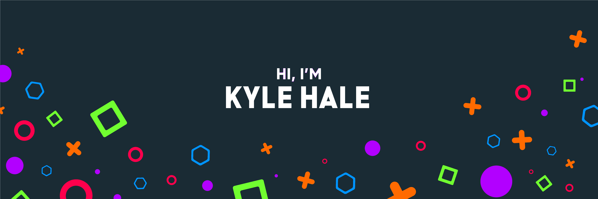

Hey there 👋

I’m Kyle, a web developer, creative coder who specializes in front-end and back-end development. I make it my mission to change beautiful designs into amazing functioning websites or applications that run blazing fast. I hate it when websites are slow, so I minimize and remove anything that isn't needed to get maximum performance.

## 📌 Pinned Repositories

 

 

 

 
 

## &#x1f4c8; GitHub Stats

 

 
 

## 💼 Skills

This is just a few of my skills :)

 

Current Occupation = 

